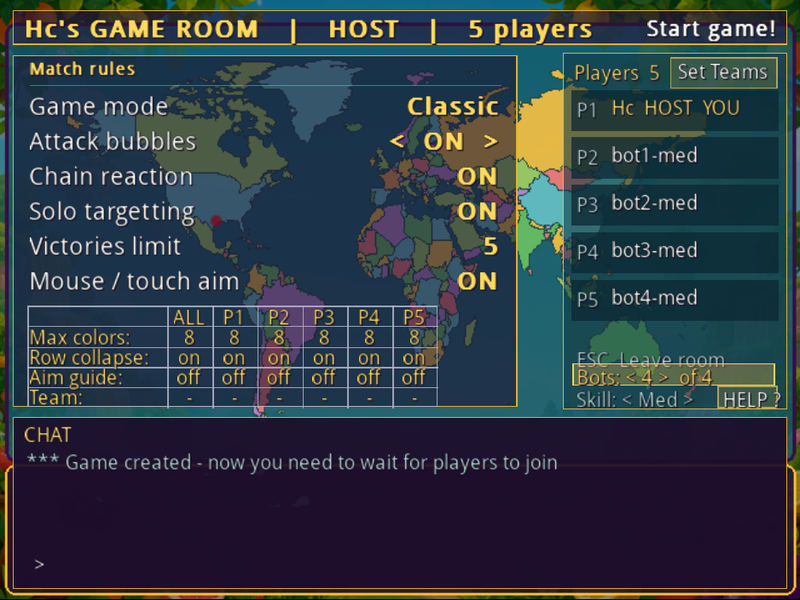
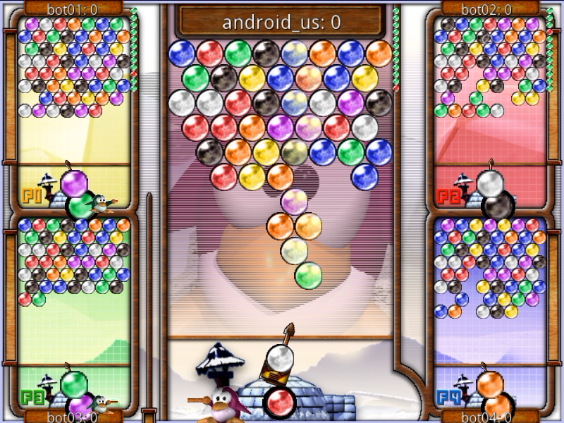
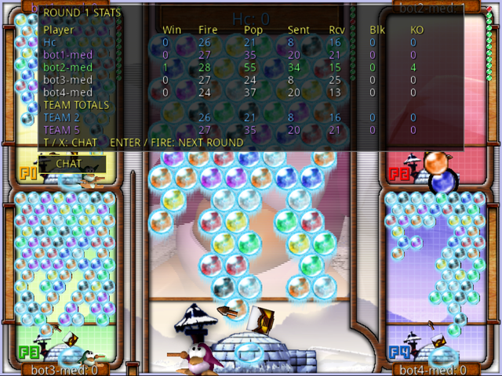

# Frozen-Bubble: SDL3
<p align="center">
  
</p>

A C++ / SDL3 port of the classic [Frozen Bubble 2](http://www.frozen-bubble.org/), reimplementing its gameplay, network multiplayer, and chain reaction system. The original was Linux-only; this port runs on **Linux, macOS, Windows, Android TV, and in the browser**.

The original was written in Perl; this is a full rewrite in C++. Core gameplay and the network protocol are faithfully reproduced, but edge-case mechanics may still differ — bug reports are welcome via [GitHub Issues](https://github.com/dchau360/frozen-bubble-sdl3/issues).

---

## Game Modes

Frozen Bubble is a free, open-source arcade puzzle game: aim, fire, and pop
chains of colored bubbles before they reach the bottom. A faithful port of
the beloved 2002 classic, rebuilt from scratch for modern devices — with
four multiplayer modes and full team play, local or online.

**Four ways to play multiplayer**

- **Classic** — last player or team standing wins.
- **Clear Mode** — first to clear your entire board wins the round.
- **Race** — first to pop a target number of bubbles (50 by default) wins.
- **Timed** — most bubbles popped when the clock runs out (30 seconds by default) wins.

Every mode plays the same whether you're local or online, and the host can adjust each mode's numbers to fit the room.

**Teams** — join a team, or stay a free agent, from any room's Set Teams screen — teams work in all four modes above, not just one. Teammates share the win when one of you takes the round, and in Timed mode your team's pops even pool together, so a coordinated pair can out-pop a solo player. Hosts get one-tap Auto-balance buttons to split the room into 2, 3, 4, or 5 teams instantly.

**Online multiplayer** — play with friends or strangers over the internet, 2–20 players per room, on the included dedicated server. Rooms bigger than 5 players get a battle-royale layout showing your most relevant opponents, quick-target hotkeys, and a spectate mode once you're out. The host controls chain reactions, attack bubbles, per-player aim assist, mouse/touch aim, and more — every joined player sees the rules update live.

**Local multiplayer** — 2–5 players, one device — keyboard, controller, or a mix. Empty seats can be filled with bots at three skill levels, so a bigger match doesn't need a full house of controllers.

> Local games above two players are **experimental** — far less
> play-tested than two-player and network play, and the smaller side boards
> have had rendering glitches. Two causes are fixed (see
> [CHANGELOG.md](CHANGELOG.md)); the mode has not had a full pass since.

**Single player** — 100 levels of classic bubble-popping, with scoring and chain reactions.

**Attack bubbles** is a three-way setting, host-controlled in the room and per-player in local multiplayer: **ON** sends every malus you earn straight at your opponents, **OFF** turns attacks off entirely, and **Blockable** has the malus you earn pay down whatever is still queued against you first, sending only the surplus — it can't go negative, so blocking more than you owe just empties your queue rather than banking credit. A HELP button next to Bot skill (or **F1**/gamepad **Y** anytime) opens a full settings guide covering this and everything else on the panel, including how malus targeting differs once a room has 6 or more players alive.

<p align="center">
  
  
</p>

After each round a per-player stats table shows bubbles fired and popped, malus sent, received, and blocked, and kills. In-game chat works during play (**Enter** or **T**, gamepad **X**) and between rounds.

**Bots.** The host of a room can add up to four bots from the setting under the player list, with a skill of Low/Med/High — each bot keeps whatever skill was set at the moment it was added, so a room can mix difficulties (add a High bot, change the setting, add a Low one). Each one joins as an ordinary member — everyone sees it in the roster and it counts against the room's cap — and plays with the same aiming as a local-multiplayer bot: a High bot plans one shot ahead using the next-bubble preview, on top of always taking the best pop it can find, and reacts roughly 3x faster than a Low one. Handy for filling out a room, or for playing on a quiet server. Works on every platform, including the itch.io browser build — a browser bot opens its own WebSocket to the server instead of a raw socket. Bot thinking happens on the host's own device, not the server: each bot's board runs inside the host's client like a hidden extra player, so a room full of bots draws on the host's CPU (and, on a laptop or phone, its battery), not the server's. A server can also cap how many bots may be running across the whole server, in which case adding one past that limit fails with a chat message rather than a crash — that's the server operator's setting, not yours ([SetupServer.md](SetupServer.md#optional--limit-concurrent-bots)).

**Dealing with abusive players.** If you host the room, `/kick p2` removes the player in that roster position (`/kick <nick>` works too). Type `/block <nick>` in chat to hide someone's messages — in the lobby and mid-match both, and it takes effect immediately without needing the server's cooperation. `/unblock <nick>` undoes it, `/blocked` lists who you have blocked, and the list is saved per device. `/report <nick> <what happened>` sends a report to that server's operator; each server is run by a different person, so what happens next is up to them — blocking is the part that is in your hands. Type `/help` in chat for the full list.

<p align="center">
  
</p>

---

## Controls

| Action | Keyboard | Mouse | Touch |
|---|---|---|---|
| Aim | Left / Right arrow | Move mouse | Tap left / right half, or drag |
| Fire | Up arrow or Space | Left click | Tap centre, or tap target |
| Back / quit | Escape | Right click | Swipe left |

In menus on touch devices: tap to select, swipe up/down to scroll, swipe left to go back. To leave a round in progress, swipe left **across the bottom of the screen**, level with the launcher or below it — anywhere higher is where you aim, so the swipe is confined to the band that aiming ignores and can't quit your game by accident. In list-style panels — settings, the LAN and Net server lists, the connect form, and the online lobby and game room — the first tap on a row highlights it and a second tap on the same row activates it, so you can see what a row says before changing it. Rows adjusted sideways (like game speed) step with a second tap on either half, rather than needing L/R keys. In the game room's per-player grid, a tap picks the cell first, so you never change the wrong player's setting by mis-tapping.

Tapping **Chat** raises the keyboard and shows the full chat log over the map while you type, rather than the usual last few lines, so you can see what you're replying to.

Mouse and touch aiming are enabled per-room by the host, and change the in-game gestures above: with them off, tapping a screen half aims that way; with them on, you drag to aim and tap to fire at a point.

> **Fairness:** free-angle mouse/touch aim is easier than keyboard left/right aiming. In network games the host should set this consistently so everyone plays with the same scheme.

**Controllers** (Android TV and desktop): D-pad left/right aims, **A** or D-pad up fires and selects, **B** goes back, **Start** pauses. Rebind anything under Settings → Keys, per player — navigate with up/down, press Enter, then press the button you want. **Reset ctrl defaults** restores that player's defaults, and **Reset all settings** at the bottom of the same panel restores everything — key bindings, speed, sound, mouse aim. It asks for a second press before it does anything.

Mouse/touch aim is on by default where there is no keyboard — in the browser, on iOS, and on Android phones and tablets — and off on desktop and Android TV. Either way it is a per-device setting you can change, and keyboard or controller aiming keeps working alongside it: whichever you used last takes over.

---

## Playing in the browser

The browser build runs anywhere with WebAssembly support. Settings, key bindings, level history and high scores are saved in the browser and survive a reload, scoped to that browser profile and the exact origin — they don't follow you to another browser, device, host or port. In a private window, or where site storage is blocked, the game falls back to session-only defaults and logs a diagnostic to the console. Details in [web/README.md](web/README.md#saved-data).

**Game speed** (Settings → speed, 1.0×–5.0×) is normalized to real elapsed time, so it should hold steady regardless of frame rate — but a device that can't sustain the frame rate a high setting demands, older Android hardware especially, can still fall short of it: the same guard that prevents a huge jump after resuming from the background also caps how much a single slow frame is allowed to catch up. That's why Android's own default (2.0×) is set lower than desktop's (3.0×). The browser build sidesteps the question entirely by always running a fixed internal rate rather than your saved setting, which is part of why it tends to look the most consistent across devices.

---

## Network play

**Run a server:**

```bash
./start-server.sh          # default port 1511
./start-server.sh -p 1234  # custom port
./start-server.sh -d       # debug output
```

This enables both TCP (direct connections) and UDP broadcast (LAN auto-discovery).

**Host a game:** start the server, then launch the game and pick **LAN Game** (auto-discovers) or **Net Game** (enter an IP). Create a room and wait for players.

**Join:** **LAN Game** to auto-discover on your network, or **Net Game** and enter the host's IP. Any player pressing Enter after a round ends starts the next round for everyone.

> LAN auto-discovery needs a UDP broadcast, which browsers cannot send — the browser build's **LAN Game** list is always empty. Use **Net Game** with the host's address there, or play native.

**Public servers** are listed in the [frozen-bubble-servers](https://github.com/dchau360/frozen-bubble-servers) repo, in the same format as the original `frozen-bubble.org` list:

```
# host port
myserver.example.com 1511
```

The game fetches this list automatically on startup. Submit a PR there to add yours.

---

## Android TV

Sideload with the **Downloader** app from the Amazon Appstore: enter code **1308098** (or the URL `http://aftv.news/1308098`) and follow the prompts.

**Entering text** (IP address, nickname): when a field is active the on-screen keyboard appears. If **Delete/Clear** doesn't respond straight away, press any letter key first — the field is then active, and Delete will erase both it and the existing text.

**If the game feels sluggish** — slow menus, laggy aiming, a late-responding remote — reboot the Fire TV (Settings → My Fire TV → Restart) and launch it again. Fire TV boxes and sticks are memory-tight, and a device that has been up a long time with other apps behind it leaves the game much less to work with. This is worth trying before assuming a bug; if it is still slow on a freshly rebooted device, that is worth a [bug report](https://github.com/dchau360/frozen-bubble-sdl3/issues).

**On a phone or tablet**, the same APK installs and rotates freely with the device, decided automatically from the device's UI mode — a TV box stays landscape-locked. Mouse/touch aim is also on by default there; see [Controls](#controls).

---

## macOS notes

Releases are **Apple Silicon (arm64) only** and will not launch on an Intel Mac. Intel users can [build from source](docs/BUILDING.md) or play in the browser. Universal binaries would mean building SDL3 and every dependency for both architectures, since Homebrew ships single-architecture bottles.

The app is ad-hoc signed but not notarized, so macOS may report it as "damaged and can't be opened". Strip the quarantine flag:

```bash
xattr -cr /Applications/FrozenBubble.app
```

Or right-click the app → **Open** → **Open** to bypass Gatekeeper once.

---

## Download

Latest builds are on the [releases page](https://github.com/dchau360/frozen-bubble-sdl3/releases/latest). [itch.io](https://dchau360.itch.io/frozenbubble2) hosts the browser version.

| Platform | Download | Notes |
|---|---|---|
| **Linux** | `frozen-bubble-linux-x86_64.AppImage` | `chmod +x` and run |
| **macOS** | `frozen-bubble-macos-arm64.dmg` | **Apple Silicon only** — see [macOS notes](#macos-notes) |
| **Windows** | `frozen-bubble-windows-setup.exe` | Unsigned; SmartScreen will warn |
| **Android** | `frozen-bubble-android-tv.apk` | Same APK for TV boxes and phones/tablets — see [Android](#android-tv) |
| **Browser** | [Play on itch.io](https://dchau360.itch.io/frozenbubble2) | Works on desktop and mobile, including iPhone |

**iOS** has no download: the build exists but is experimental and unsigned, so it
must be re-signed before a device will install it. Build it yourself with
`tools/build-ios.sh` — see [docs/IOS.md](docs/IOS.md). To just play on an iPhone,
use the browser build above.

Building from source: [docs/BUILDING.md](docs/BUILDING.md).

---

## Community

[Join the Discord](https://discord.gg/uE4dq8fqGW) — the same invite the
**Join our Discord** row on the NET GAME server list and the online lobby
opens in your browser. There's an alert whenever someone connects to a
public server, plus a result alert at the end of every round — game mode,
winner (or draw), and the full player roster — if you're looking for an
opponent or just keeping an eye on how things are going.

Running your own server? It can post its own join and round-result alerts to
a Discord channel of your choosing — see [SetupServer.md](SetupServer.md#optional--discord-join--result-alerts).

---

## More

- [Changelog](CHANGELOG.md) — release history
- [Privacy policy](https://dchau360.github.io/frozen-bubble-sdl3/) — what data the app and its servers handle
- [Building from source](docs/BUILDING.md) — all platforms, including WebAssembly, Android and iOS
- [iOS notes](docs/IOS.md) — experimental unsigned build, and how to sign it
- [Compared with the original](docs/PARITY.md) — features added, fixes to the original's own server code, and what's reproduced unchanged
- [Browser build notes](web/README.md) — saved data, Emscripten port status, serving locally

---

## Credits

Original Frozen Bubble by [Guillaume Cottenceau et al.](http://www.frozen-bubble.org/) — GPL licensed.
This port is independently developed and not affiliated with the original project.

### Third-party components

- [iniparser](https://github.com/ndevilla/iniparser) by Nicolas Devillard — MIT licensed, vendored in `third_party/iniparser/` and compiled into every release artifact. See [LICENSE](third_party/iniparser/LICENSE) and [PROVENANCE.md](third_party/iniparser/PROVENANCE.md).
- SDL3, SDL3_image, SDL3_mixer, SDL3_ttf — zlib licensed, linked at build time.
- Bot shot-scoring model (`src/bubbleai.cpp`) ported from [zepr/fbjs](https://github.com/zepr/fbjs)'s [`cpu.js`](https://github.com/zepr/fbjs/blob/master/src/main/resources/static/game/scripts/cpu.js) — GPL-3.0 licensed. Not vendored code: the scoring weights (popped/detached/cluster bonuses, the positional heatmap) were reimplemented in C++ against this port's own board representation.
